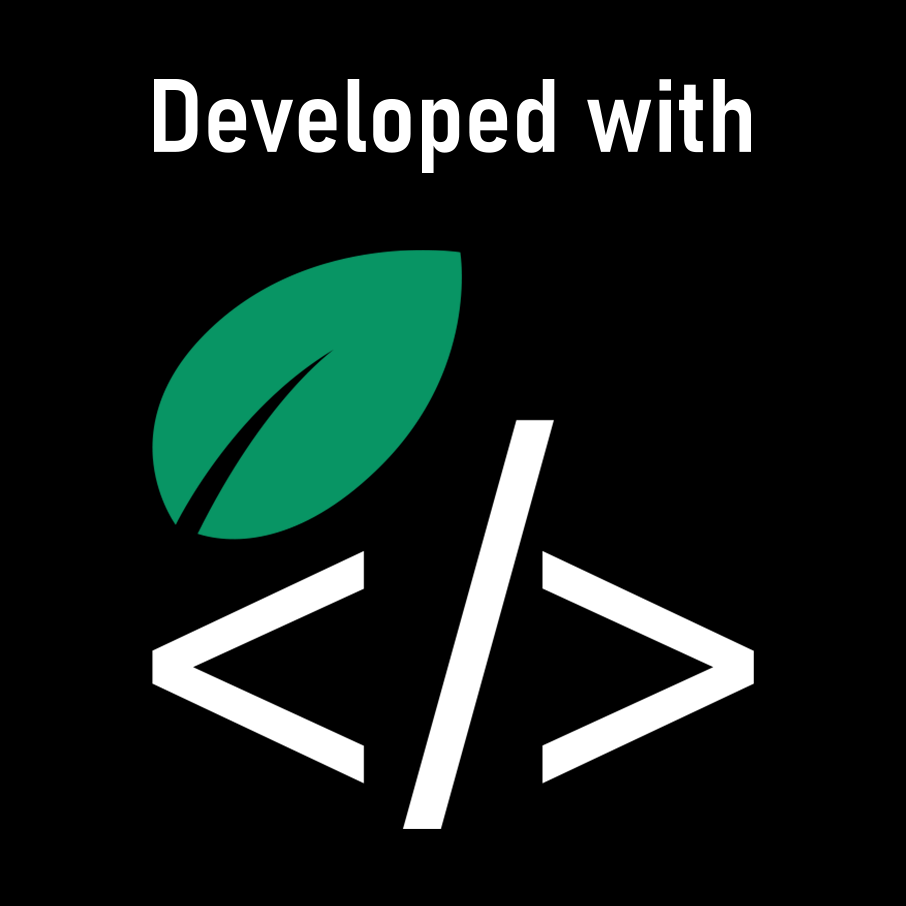

<div align="center">

<h1 align="center">Diabetes Prediction Project 🩺</h1>


```
 ____  _       _          _              ____               _ _      _   _             
|  _ \(_) __ _| |__   ___| |_ ___  ___  |  _ \ _ __ ___  __| (_) ___| |_(_) ___  _ __  
| | | | |/ _` | '_ \ / _ \ __/ _ \/ __  | |_) | '__/ _ \/ _` | |/ __| __| |/ _ \| '_ \ 
| |_| | | (_| | |_) |  __/ ||  __/\__ \ |  __/| | |  __/ (_| | | (__| |_| | (_) | | | |
|____/|_|\__,_|_.__/ \___|\__\___||___/ | _|   |_|  \___|\__,_|_|\___|\__|_|\___/|_| |_|
```

[](https://opensource.org/licenses/MIT)
[](https://www.python.org/)
[](https://scikit-learn.org/)
[](https://pandas.pydata.org/)
[](https://www.kaggle.com/datasets/uciml/pima-indians-diabetes-database)
[](https://greensoftware.foundation/)

> A machine learning project for predicting diabetes using various classification algorithms.



</div>

## Overview

This project uses machine learning models to predict the likelihood of diabetes in patients based on diagnostic measurements. The project includes data preprocessing, exploratory data analysis, model training, and evaluation of different machine learning algorithms.

## Project Structure

```
.
├── diabetes-dataset.csv     # Raw patient diagnostic dataset
├── Diabetics.ipynb          # Jupyter notebook with analysis and models
├── KNN_best_model.pkl       # Saved K-Nearest Neighbors model
├── model_accuracies.csv     # Performance metrics of different models
└── LICENSE                  # MIT License file
```

## Dataset

The dataset contains the following features:

- **Pregnancies**: Number of times pregnant
- **Glucose**: Plasma glucose concentration
- **BloodPressure**: Diastolic blood pressure (mm Hg)
- **SkinThickness**: Triceps skin fold thickness (mm)
- **Insulin**: 2-Hour serum insulin (mu U/ml)
- **BMI**: Body mass index (weight in kg/(height in m)²)
- **DiabetesPedigreeFunction**: Diabetes pedigree function
- **Age**: Age (years)
- **Outcome**: Class variable (0 or 1) indicating whether the patient has diabetes

### Dataset Statistics

| Feature               | Mean    | Std    | Min   | Max    |
|-----------------------|---------|--------|-------|--------|
| Pregnancies           | 3.85    | 3.37   | 0.00  | 17.00  |
| Glucose               | 120.89  | 31.97  | 0.00  | 199.00 |
| BMI                   | 31.99   | 7.88   | 0.00  | 67.10  |
| Age                   | 33.24   | 11.76  | 21.00 | 81.00  |

## Methodology

The project follows these steps:

1. **Data Loading and Preprocessing**:
   - Loading the dataset from diabetes-dataset.csv
   - Handling missing values using KNN Imputation
   - Feature scaling using MinMaxScaler

2. **Exploratory Data Analysis**:
   - Statistical summary of features
   - Visualization of feature distributions and relationships

3. **Model Training and Evaluation**:
   - Train-test split
   - Training multiple classification models:
     ```
     +---------------+     +----------------+     +---------------+
     | Logistic      |     | K-Nearest      |     | Support       |
     | Regression    |     | Neighbors      |     | Vector Machine|
     +---------------+     +----------------+     +---------------+
     
     +---------------+     +----------------+     +---------------+
     | Naive Bayes   |     | Decision Tree  |     | Random Forest |
     |               |     |                |     |               |
     +---------------+     +----------------+     +---------------+
     ```

4. **Model Comparison**:
   - Evaluation using accuracy score, confusion matrix, and classification report

##  Libraries Used

```
+----------------+----------------+----------------+
| pandas         | numpy          | seaborn        |
+----------------+----------------+----------------+
| matplotlib     | scikit-learn   | joblib         |
+----------------+----------------+----------------+
| rich           |                |                |
+----------------+----------------+----------------+
```

## Usage

### Requirements

- Python 3.x
- Required packages:
  ```
  pandas, numpy, seaborn, matplotlib, scikit-learn, joblib, rich
  ```

### Running the Project

1. Clone this repository
   ```bash
   git clone https://github.com/niloydebbarma-code/Diabetics-Prediction.git
   ```

2. Install the required packages:
   ```bash
   pip install pandas numpy seaborn matplotlib scikit-learn joblib rich
   ```

3. Run the Jupyter notebook:
   ```bash
   jupyter notebook Diabetics.ipynb
   ```


## 🌱 Green Coding Certification

```
    .-.                                                   
   (o o) _______                                         
   | O \| GREEN |                                         
    \___/|CODING|                                        
        |_______|                                        
```

This project follows green coding principles, optimizing computational resources and minimizing environmental impact:

- ✅ Efficient data preprocessing to reduce memory usage
- ✅ Optimized machine learning algorithms implementation
- ✅ Model persistence to avoid redundant computation

## License

This project is licensed under the MIT License - see the [LICENSE](LICENSE) file for details.